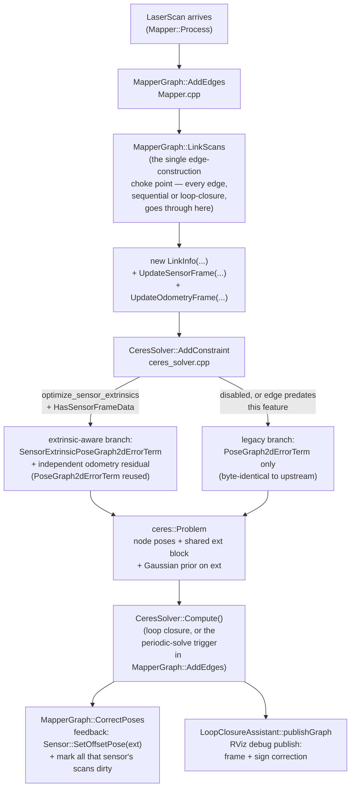
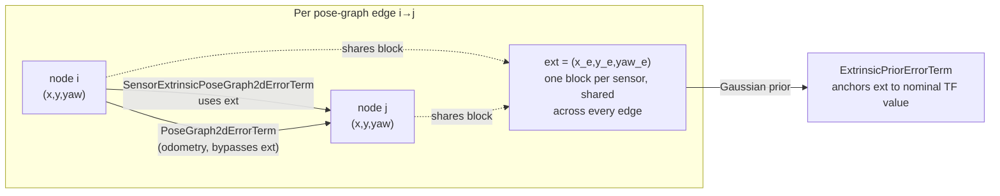

# Online lidar↔base_link extrinsic calibration

This document describes a feature added to this `slam_toolbox` fork: **online, joint estimation of the 2D (x, y, yaw) rigid transform between the lidar and `base_link`**, inside the same Ceres pose-graph solve that already estimates robot poses. It is self-contained — everything needed to understand, maintain, extend, or re-apply this feature after a rebase onto upstream `slam_toolbox` is here.

## 1. Overview

### The problem

The lidar↔`base_link` mounting transform is normally read once from TF at startup and trusted forever (`Sensor::m_pOffsetPose` in `karto_sdk`). Real mounting tolerances mean this nominal value is never exactly right. An unmodeled offset causes a systematic, **heading-dependent** map↔odom drift: driving away from the origin accumulates error that collapses back toward zero when driving back along the same headings — the signature of a fixed sensor-frame bias, not random-walk noise. This was confirmed experimentally on a Gazebo test rig with a deliberate mounting error injected via a `lidar_offset_link` in the URDF (`afw_launch/xacro/autogrinder.xacro`, an extra fixed joint offset from `lidar_link` that the lidar plugin actually publishes scans from, while `slam_toolbox`'s config still nominally assumes `lidar_link`).

### The approach

The lidar↔base_link extrinsic (x, y, yaw) is a **live, jointly-optimized Ceres parameter block**, shared across every pose-graph edge from that sensor, anchored to the nominal TF-derived value by a Gaussian prior, and refined online as the robot drives. This is the same idea as online camera-IMU extrinsic calibration in visual-inertial systems, applied to lidar↔base extrinsics in 2D pose-graph SLAM.

**Key trick that makes it actually work** (see §3.3 for why it's necessary, not optional): the extrinsic is estimated using **two independent measurement streams per pose-graph edge** — the existing scan-matcher measurement (sensor-frame) *and* an independent odometry measurement (robot-frame, from fused wheel+IMU odometry already flowing through the pipeline but previously unused for this purpose). Without the second stream, the calibration is mathematically unable to converge to anything but its prior, no matter how the robot drives.

### Scope this was built for

- **Single 2D lidar, single sensor name.** No multi-sensor extrinsic calibration. The design assumes every pose-graph edge's two endpoints belong to the same named sensor (not exhaustively guarded, just not expected to happen on this hardware).
- **Fully joint, single-Ceres-problem estimation**, not a decoupled/periodic calibration pass that would run outside the core SLAM solve. A decoupled pass was considered and rejected because it can't share information with the pose-graph solve itself and would need to duplicate significant machinery.
- **A periodic (every-N-nodes) pose-graph solve trigger** is included, gated behind its own flag (`enable_periodic_pose_graph_solve`) independent of `optimize_sensor_extrinsics` — the graph normally only re-solves on loop closure, which is too infrequent for calibration to visibly converge while driving without ever revisiting mapped area. This flag is independently useful for general drift correction even without extrinsic calibration enabled.
- **An RViz debug publisher** for the live extrinsic estimate (pose + covariance), so calibration can be watched converging while driving.

## 2. Architecture / data flow



Every node above names the exact function/file, so this diagram doubles as a navigation aid — start reading at whichever box matches the bug or feature you're working on.

## 3. The math

This is the part most worth getting right — it took the longest to work out and is the least recoverable from code alone.

### 3.1 SE(2) convention

Every pose in this codebase composes as `karto::Transform(pose1, pose2).TransformPose(...)`, and the fundamental convention (verified by full symbolic expansion against `Transform::TransformPose` in `Karto.h`) is:

```
sensorPose = robotPose ∘ offset
sensorPose.pos     = robotPose.pos + R(robotPose.heading) · offset.pos
sensorPose.heading = normalize(robotPose.heading + offset.heading)
```

`LocalizedRangeScan::GetSensorAt()`/`GetCorrectedAt()` implement this composition and its algebraic inverse respectively. Every residual in this codebase (`PoseGraph2dErrorTerm`, `LinkInfo::Update`, etc.) computes "B expressed in A's local frame": `R(-yaw_a)·(p_b - p_a)` for translation, `normalize(yaw_b - yaw_a)` for heading.

### 3.2 The rotation-reference pitfall

The natural first draft of an extrinsic-aware residual — copy `PoseGraph2dErrorTerm`'s pattern and rotate by `yaw_a` (the node's own heading) — is **wrong and silently inert**: the extrinsic yaw `yaw_e` cancels out of every residual identically, leaving it permanently unobservable with zero gradient. It compiles, runs, and simply never moves yaw off its prior — nothing errors.

**The fix, in `SensorExtrinsicPoseGraph2dErrorTerm` (`solvers/ceres_utils.h`):** the rotation reference must be the full *composed sensor heading*, `yaw_a + yaw_e` (and `yaw_b + yaw_e`), never `yaw_a`/`yaw_b` alone:

```cpp
const T sensor_yaw_a = *yaw_a + *yaw_e;
const Eigen::Matrix<T, 2, 1> sensor_p_a =
    Eigen::Matrix<T, 2, 1>(*x_a, *y_a) + RotationMatrix2D(*yaw_a) * ext;
// ... sensor_yaw_b, sensor_p_b analogously ...
residuals_map.head<2>() =
    RotationMatrix2D(sensor_yaw_a).transpose() * (sensor_p_b - sensor_p_a) - p_ab_;
residuals_map(2) = NormalizeAngle((sensor_yaw_b - sensor_yaw_a) - yaw_ab_radians_);
```

`test/ceres_extrinsic_test.cpp`'s `DiverseMotionRecoversExtrinsic` test is the regression guard: if this regresses back to `RotationMatrix2D(yaw_a)`, yaw silently stops converging and that test's yaw assertion fails.

### 3.3 The observability gap, and why odometry fixes it

This is the single most important thing to understand about this feature, and the easiest thing to get wrong if extended.

**Claim:** a pose graph built *only* from sensor-frame relative measurements (scan-matcher edges), with node poses otherwise completely free except one pinned gauge node, **cannot identify the extrinsic** — not weakly, not with enough loop closures or heading diversity, but *exactly, algebraically, regardless of topology or noise*.

**Proof sketch.** Every edge residual has the form (from §3.2, with `T_ij` the frozen sensor-frame measurement):

```
robot_pose_i⁻¹ ∘ robot_pose_j = ext ∘ T_ij ∘ ext⁻¹
```

Because node poses are otherwise free, for **any** candidate `ext`, reconstruct node poses via a spanning tree: pin node 0, and for each tree edge set `robot_pose_child = robot_pose_parent ∘ (ext ∘ T_edge ∘ ext⁻¹)`. This telescopes (the `ext⁻¹∘ext` pairs cancel along the path) to `robot_pose_k = ext ∘ P_k ∘ ext⁻¹`, where `P_k` is the pure measurement-chain product along the tree path to node k — no `ext` dependence in `P_k` itself. Every tree edge is then satisfied *exactly*, for *any* `ext`, by construction.

For a non-tree (redundant/loop-closing) edge `(i,j)`, its own residual-zero condition becomes `ext∘(P_i⁻¹∘P_j)∘ext⁻¹ = ext∘T_ij∘ext⁻¹`. Conjugation by a fixed group element is injective, so this cancels to `P_i⁻¹∘P_j = T_ij` — **an `ext`-independent condition**. So the *entire* cost function, minimized over node poses for any fixed `ext`, is constant in `ext`. The only thing left touching `ext` at all is the Gaussian prior — so without a second, independent constraint, the "calibration" just sits at its prior forever, no matter how the robot drives or how many loop closures occur.

This was originally discovered empirically (a synthetic unit test with genuine heading diversity and even a loop closure still showed the estimate never moving off its prior in x, y, *and* yaw — not just yaw as the §3.2 pitfall alone would predict), then proven algebraically as above.

**The fix — an independent robot-frame measurement stream.** This is exactly the structure of hand-eye calibration (`AX = XB`): you cannot recover an unknown rigid transform from one measurement stream alone; you need a second, independently-measured stream of the *same* motion, expressed in a *different* frame. Conveniently, this codebase already captures exactly that, per scan, and simply never used it as a graph constraint:

- `LocalizedRangeScan::GetOdometricPose()`/`SetOdometricPose()` (`Karto.h`) is set once per scan from `pose_helper_->getOdomPose(...)` — a TF lookup of `base_frame → odom_frame` at the scan's timestamp (`include/slam_toolbox/get_pose_helper.hpp`). In this deployment `odom_frame`'s TF is published by an EKF (`robot_localization`, fusing wheel odometry + IMU yaw rate — see `afw_launch/params/ekf.yaml`), so this is a genuinely lidar-independent robot-frame motion estimate.
- In `Mapper::Process()` (the entry point the standard sync/async mapping nodes use — **not** `ProcessAgainstNodesNearBy`/`ProcessLocalization`, which overwrite `m_OdometricPose` with the scan-matched pose and so don't get this benefit), `m_OdometricPose` is read to seed the initial corrected-pose guess but **never overwritten** by scan matching, so it survives unchanged all the way to `AddEdges`/`LinkScans`.

`MapperGraph::LinkScans` now also calls `pLinkInfo->UpdateOdometryFrame(pFromScan->GetOdometricPose(), pToScan->GetOdometricPose())`, and `CeresSolver::AddConstraint` adds a **second, independent residual per edge** — a plain `PoseGraph2dErrorTerm` (no `ext` parameter at all) on the *same* two node parameter blocks, weighted by `odometry_edge_stddev_xy`/`odometry_edge_stddev_yaw`. The joint system must now reconcile `D_odom_ij ≈ ext∘T_ij∘ext⁻¹` for every edge — the `AX=XB` equation — which genuinely determines `ext` (up to the classic requirement of heading diversity across edges to fully condition it, matching intuition: rotation typically gets pinned down faster than translation in this kind of calibration).



`WithoutOdometryExtrinsicStaysAtPrior` in `test/ceres_extrinsic_test.cpp` is the regression guard for this: the exact same diverse trajectory as the passing test, but with no odometry edges, and the assertion is that the estimate must **not** move off nominal. If this test ever starts failing (estimate moving toward ground truth without odometry), something has changed the observability structure and needs investigating before trusting it — not loosening the assertion.

### 3.4 Upside-down mount sign fix (RViz debug view only)

If the lidar is physically mounted upside-down (its own TF frame's Z axis points down in world space — common when the mount requires it), a subtlety appears **only in the RViz debug publisher**, not in the estimation itself.

The 2D SE(2) pipeline has no notion of roll/pitch — every yaw value it ever produces (nominal and estimate alike) is implicitly "measured about `base_frame`'s own upright Z axis," because that's what `tf2::getYaw()` (used once, at startup, in `LaserAssistant::isInverted()`, to reduce the nominal TF lookup to a scalar) actually extracts. If the lidar's own frame is Z-flipped and the debug marker is published as a rotation *about that flipped frame's own Z axis* (to visually co-locate it with the lidar for easy comparison in RViz), the angle's visual sense gets silently negated. This follows from the standard conjugation identity: `R·Rz(θ)·R⁻¹ = Rz(−θ)` whenever `R` maps `Z → −Z`.

**Fix (`LoopClosureAssistant::isLidarFrameInverted()`, `src/loop_closure_assistant.cpp`):** detect the flip via a live TF lookup (rotate the vector `(0,0,1)` from `base_frame` into `lidar_frame` and check if the result points down — the exact same technique `LaserAssistant::isInverted()` already uses for scan-ray-order correction), lazily computed and cached. When inverted, negate the published heading before building the marker's quaternion. Position is unaffected — translation doesn't have a rotation-handedness issue.

This only handles the binary upside-down case (a full 180° flip of the frame's up axis), not arbitrary partial roll/pitch tilts — see §6.

## 4. Implementation map

Files marked **(new)** did not exist before this feature. Everything else modifies existing upstream `slam_toolbox`/`karto_sdk` logic — this is the list to consult when resolving rebase conflicts against upstream.

| File | What changed |
|---|---|
| `lib/karto_sdk/include/karto_sdk/Mapper.h` | `LinkInfo`: new sensor-frame fields (`UpdateSensorFrame`/`GetSensorPoseDifference`/`GetSensorCovariance`/`HasSensorFrameData`) and odometry-frame fields (`UpdateOdometryFrame`/`GetOdomPoseDifference`/`HasOdomFrameData`), versioned `serialize()` (see §5). `ScanSolver`: new optional virtuals `GetSensorOffsetCorrections`/`GetSensorOffsetCovariances`/`GetSensorNominalOffsets` (default-empty, same pattern as existing optional virtuals like `getGraph`). `Mapper`/`MapperGraph`: new `Parameter<>` members + getter/setter pairs for `EnablePeriodicPoseGraphSolve`/`PeriodicSolveIntervalNodes`, plus a `m_NodesSinceLastPeriodicSolve` counter on `MapperGraph`. |
| `lib/karto_sdk/src/Mapper.cpp` | `BOOST_CLASS_VERSION(karto::LinkInfo, 2)` — **must stay at file/global scope, not inside `namespace karto`** (see §5 gotcha). `MapperGraph::LinkScans` — the single edge-construction choke point (every edge, sequential/chain/loop-closure, funnels through here) — now also calls `UpdateSensorFrame`/`UpdateOdometryFrame` on every new `LinkInfo`. `MapperGraph::AddEdges` — periodic-solve trigger appended at the end (increments the counter, calls `CorrectPoses()` and resets it when `enable_periodic_pose_graph_solve` is true and the threshold is hit). `MapperGraph::CorrectPoses` — feedback loop appended after the existing per-node correction loop: for each sensor in `GetSensorOffsetCorrections()`, calls `Sensor::SetOffsetPose()` and marks that sensor's scans dirty (forces cached point clouds to rebuild against the new offset). Mapper param getter/setter implementations for the two new periodic-solve params. |
| `solvers/ceres_solver.hpp`/`.cpp` | New members: `sensor_offsets_`, `sensor_offsets_initialized_`, `sensor_offset_covariances_`, `sensor_offset_corrections_`, `sensor_nominal_offsets_`, `optimize_sensor_extrinsics_`, `extrinsic_prior_stddev_{xy,yaw}_`, `odometry_edge_stddev_{xy,yaw}_`. New private `GetOrCreateSensorOffset()` — lazily creates the shared extrinsic parameter block for a sensor name and its prior residual (order matters: `AddResidualBlock` must come *before* `SetParameterization`, since Ceres only creates a parameter block implicitly on first reference — this was a real bug caught by the test suite during implementation). `AddConstraint` rewritten to branch on `optimize_sensor_extrinsics_ && pLinkInfo->HasSensorFrameData()`: extrinsic-aware path adds the `SensorExtrinsicPoseGraph2dErrorTerm` residual plus (if `HasOdomFrameData()`) the independent odometry residual; else the legacy `PoseGraph2dErrorTerm`-only path (byte-identical to pre-feature behavior). `blocks_` changed from `unordered_map<hash, ResidualBlockId>` to `unordered_map<hash, vector<ResidualBlockId>>` since one edge can now own two residual blocks; `RemoveConstraint` removes all of them. `Compute()` additionally populates `sensor_offset_corrections_` and computes marginal covariances via `ceres::Covariance` when `optimize_sensor_extrinsics_` is true. `Configure()` reads all the new params plus `ceres_num_threads` (previously hardcoded to `50`, now actually wired to `options_.num_threads`). `Reset()`/destructor manage the new members' lifecycle alongside the existing `nodes_`/`blocks_` pattern. |
| `solvers/ceres_utils.h` | New `SensorExtrinsicPoseGraph2dErrorTerm` (§3.2) and `ExtrinsicPriorErrorTerm` functors. The existing `PoseGraph2dErrorTerm` is reused unmodified for both the legacy path and the new odometry residual (same mathematical form — a pure robot-frame relative-pose measurement). |
| `src/loop_closure_assistant.cpp`/`.hpp` | New `extrinsic_pub_` publisher (`slam_toolbox/sensor_extrinsic_calibration`, `PoseWithCovarianceStamped`) and `extrinsic_publish_timer_` (republishes the last cached value at `extrinsic_publish_rate` Hz so RViz redraws smoothly between real solves — `publishGraph()` only runs on `map_update_interval`/loop-closure/periodic-solve cadence, too infrequent for a live-feeling display). `publishGraph()` computes `residual = nominal⁻¹ ∘ estimate` (via `karto::Transform`, same composition pattern as `LinkInfo::Update`) and publishes it in `lidar_frame_` (falls back to `base_frame_` if unset) with the §3.4 sign correction. New `tf_` member (`tf2_ros::Buffer*`, passed in from `SlamToolbox`) for the live TF lookup `isLidarFrameInverted()` needs. |
| `src/slam_mapper.cpp` | Reads `enable_periodic_pose_graph_solve`/`periodic_solve_interval_nodes` and calls the new `Mapper` setters, same pattern as every other graph-level param already read there. |
| `src/slam_toolbox_common.cpp` | `loadSerializedPoseGraph` reordered: sensor registration (`SensorManager::GetInstance()->RegisterSensor(...)`) now happens **before** the node/edge replay loop, not after. This is a real ordering fix, not a style change — `AddConstraint`'s extrinsic-aware path looks up the sensor by name (to seed/anchor the extrinsic block), and that lookup throws if the sensor isn't registered yet; the previous order registered the sensor *after* replaying every edge, which would crash on load with `optimize_sensor_extrinsics` enabled. Also passes `tf_.get()` into the `LoopClosureAssistant` constructor. |
| `test/ceres_extrinsic_test.cpp` **(new)** | 5 tests, run entirely bypassing ROS/Gazebo (synthetic `LocalizedRangeScan`/`Vertex`/`Edge`/`LinkInfo` graphs fed directly into `CeresSolver`): `DiverseMotionRecoversExtrinsic` (the primary regression guard — converges to injected ground truth in x/y/yaw given heading-diverse motion plus odometry, no loop closure needed); `WithoutOdometryExtrinsicStaysAtPrior` (§3.3's regression guard — same scenario, no odometry, estimate must stay at prior); `PureRotationLeavesYawNearPrior` (weak-observability sanity check under degenerate motion); `DisabledFlagUsesLegacyPathAndReportsNoCorrections` and `MissingSensorFrameDataFallsBackToLegacyPath` (default-off and backward-compat safety). |
| `CMakeLists.txt` **(new content)** | Re-enabled the previously-commented-out `BUILD_TESTING` block, added the `ceres_extrinsic_test` gtest target. |

## 5. Backward compatibility

`LinkInfo::serialize()` is version-gated (`BOOST_CLASS_VERSION(karto::LinkInfo, 2)`): version ≥1 adds the sensor-frame fields, version ≥2 adds the odometry-frame fields, each guarded independently so a map serialized at any earlier version deserializes cleanly with the corresponding `Has*FrameData()` flags simply false. `AddConstraint` treats `HasSensorFrameData() == false` as "take the legacy path" — old edges replayed with extrinsic calibration now enabled don't crash, they just don't get an extrinsic-aware residual.

**Gotcha to preserve on any future edit near this:** `BOOST_CLASS_VERSION(...)` expands to `namespace boost { namespace serialization { ... } }`. If that macro invocation is placed *inside* `namespace karto { ... }` (as it was, briefly, during development), it silently defines a bogus `karto::boost::serialization` namespace instead of extending the real `::boost::serialization` one — which then shadows the real one for every `friend class boost::serialization::access;` declared later in the same translation unit (anything textually after the mistaken placement in `Mapper.h`), breaking serialization for unrelated classes (`Vertex`, `Edge`, `MapperSensorManager`, `Mapper`) with confusing "private within this context" compiler errors far from the actual cause. It must stay at file/global scope, matching the existing `BOOST_CLASS_EXPORT(karto::LinkInfo)` calls already at the top of `Mapper.cpp`.

## 6. Known limitations

- **Fixed per-edge odometry noise model.** `odometry_edge_stddev_xy`/`_yaw` apply the same weight to every edge regardless of the time/distance it spans. Fine for adjacent sequential edges (bounded by `minimum_travel_distance`/`minimum_time_interval`), but overly confident for long-span loop-closure edges, where accumulated dead-reckoning drift between the two visits is larger. `LinkScans` populates odometry data uniformly for every edge type, so this isn't currently distinguished. If it becomes a problem: either a distance/time-scaled stddev, or restrict the odometry residual to sequential edges only.
- **Localization-mode processing paths don't benefit.** `Mapper::ProcessAgainstNodesNearBy`/`ProcessLocalization` overwrite `m_OdometricPose` with the scan-matched corrected pose, destroying the independent signal §3.3 depends on. This feature only helps the standard `Mapper::Process` mapping path (sync/async nodes) — which is also the only place `optimize_sensor_extrinsics` is intended to run.
- **Upside-down mount sign fix (§3.4) handles a binary flip only** — not arbitrary partial roll/pitch tilts. A mount tilted by some angle other than ~0° or ~180° isn't correctly handled by the debug publisher's sign correction (though the *estimation* itself is unaffected either way — this is a visualization-only limitation).
- **Single-sensor assumption** throughout, per §1's scope. No code path constructing a cross-sensor edge was found, but this isn't exhaustively guarded against.
- **Bayesian shrinkage in `extrinsic_prior_stddev_*`.** The prior pulls the converged estimate toward nominal — with limited data, expect the estimate to land somewhat short of the true offset, more so for translation than rotation (translation is generally less information-rich per edge in this `AX=XB` structure). If the estimate seems to be converging short of a known true offset, loosening `extrinsic_prior_stddev_xy`/`_yaw` (or just letting more edges accumulate) reduces this bias — don't assume it's a bug before checking this first.

## 7. Config reference

All in `afw_launch/params/slam_toolbox.yaml`, `slam_toolbox.ros__parameters`:

| Param | Current value | Meaning |
|---|---|---|
| `optimize_sensor_extrinsics` | `true` | Master switch for the whole feature. Default `false` in code — everyone else's config is unaffected unless explicitly opted in. |
| `extrinsic_prior_stddev_xy` | `0.1` m | 1σ of the Gaussian prior anchoring `ext`'s (x,y) to nominal. Loosened from an initial `0.02`/`0.05` after observing Bayesian shrinkage (§6) pulling the estimate short of a known 5cm test-rig offset. |
| `extrinsic_prior_stddev_yaw` | `0.06` rad (~3.4°) | Same, for yaw. |
| `odometry_edge_stddev_xy` | `0.1` m | 1σ of the independent odometry residual (§3.3) per edge. This is what actually breaks the observability degeneracy — too loose and convergence is slow/weak; too tight (originally `0.02`, tuned against noiseless Gazebo odometry) and real EKF drift/slip gets misattributed to the extrinsic instead of treated as odometry noise, inflating the estimate. Loosened 5x after this was observed on real hardware (aug24 bags) — still a conservative starting point, not a validated final value. |
| `odometry_edge_stddev_yaw` | `0.075` rad | Same, for yaw. |
| `enable_periodic_pose_graph_solve` | `true` | Independent of `optimize_sensor_extrinsics` — re-solves the whole graph every N nodes instead of only on loop closure. |
| `periodic_solve_interval_nodes` | `20` | N above. Larger graphs cost more per periodic solve — watch solve latency if increasing map size/density. |
| `lidar_frame` | `lidar_link` | Frame the RViz debug topic publishes in. Falls back to `base_frame` if unset. |
| `extrinsic_publish_rate` | `10.0` Hz | Republish cadence for the debug topic (§4, `LoopClosureAssistant`), independent of the underlying solve rate. |
| `ceres_num_threads` | `8` | Actually wired to `ceres::Solver::Options::num_threads` (previously a dead param — the solver silently hardcoded 50 and Ceres clamped it down with a warning every run). |

Debug topic: `slam_toolbox/sensor_extrinsic_calibration` (`geometry_msgs/PoseWithCovarianceStamped`).

## 8. Rebase guidance

When rebasing this fork onto a newer upstream `slam_toolbox`/`karto_sdk`:

1. §4's table's **non-`(new)`** rows are the files where this feature's changes will conflict with upstream changes to the same functions. Re-apply by function, using this document's description of *what* each change does and *why*, rather than trying to mechanically replay a diff — upstream's own edits to `LinkScans`/`AddConstraint`/`CorrectPoses`/`loadSerializedPoseGraph` etc. may have moved things around.
2. After resolving conflicts, rebuild and run `ceres_extrinsic_test` (`cd /home/ros && ./src/scripts/build.sh --packages-select slam_toolbox && ./build/slam_toolbox/ceres_extrinsic_test`) before anything else. `DiverseMotionRecoversExtrinsic` and `WithoutOdometryExtrinsicStaysAtPrior` are the two tests that would silently pass-but-mean-nothing if the §3.2 or §3.3 fixes got lost in the merge — they're written specifically to fail loudly in that case.
3. Double check the `BOOST_CLASS_VERSION` placement (§5) survived at file scope, not inside `namespace karto` — a rebase that reflows `Mapper.cpp`'s includes/macros near the top of the file is the most likely way to reintroduce that specific mistake.
4. If upstream itself adds a raw-odometry edge type or any other independent robot-frame constraint to the pose graph, §3.3's odometry residual may become partially redundant with it — worth revisiting rather than stacking two independent odometry constraints on the same edges.
